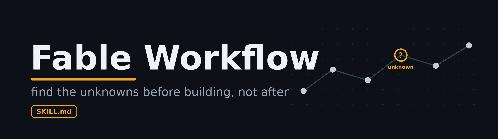
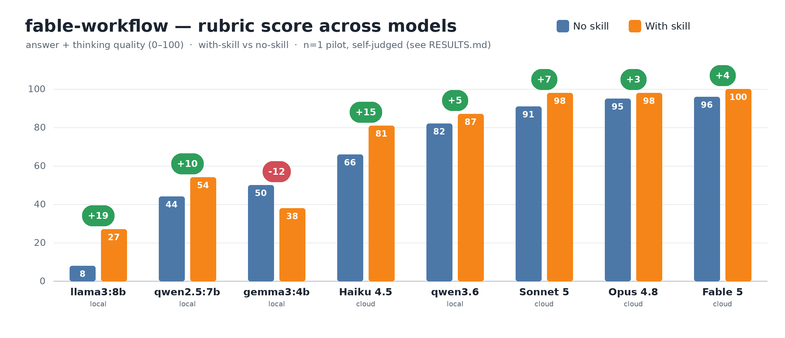

<p align="center">
  
</p>

<h1 align="center">Fable Workflow</h1>

<p align="center">
  A portable agent skill that teaches <b>any</b> model — Opus, Sonnet, Haiku, Fable —
  to work like Anthropic's Fable: <b>find the unknowns before building, not after.</b>
</p>

<p align="center">
  <b>English</b> · <a href="README.ko.md">한국어</a>
</p>

<p align="center">
  
  
  
</p>

---

## What this is

`fable-workflow` packages a working method for Anthropic's Fable-class models into a reusable [`SKILL.md`](SKILL.md) you can drop into Claude Code, Cursor, or any agent framework.

Capable models are powerful enough to explore a huge solution space on their own. So the bottleneck is no longer the *model's* ability — it's whether **your mental map matches the territory** before the model starts moving. Every place your spec is silent is an **unknown**: an unspecified decision the model will otherwise guess at silently. This skill makes the model **surface those unknowns first**, then build.

## The one idea

> **The map is not the territory.** Your plan/spec/prompt is the *map*. The real codebase and constraints are the *territory*. Wherever they diverge is an **unknown** — decide it explicitly instead of letting the model guess.

## The loop

1. **Unhobble** — reach for tools, not memory. Counting/enumeration/lookup → *write a script*, don't recall.
2. **Find the unknowns** — before building: blind-spot pass, interview-me, N variants for taste calls, references-as-maps.
3. **Build, logging deviations** — keep a running ASSUMPTIONS / NOTES list of every unknown it hits.
4. **Stay in the loop** — have the model quiz you before merge, so you still own the work.

See [`SKILL.md`](SKILL.md) for the full method and [`prompts.md`](prompts.md) for copy-paste prompts.

## Install

### Claude Code — plugin (recommended)
```shell
/plugin marketplace add joey114132/fable-workflow-skill
/plugin install fable-workflow
```

### Claude Code — manual copy
```bash
git clone https://github.com/joey114132/fable-workflow-skill.git
./fable-workflow-skill/install.sh ~/your-project/.claude/skills
```
Or copy `SKILL.md` + `prompts.md` into `~/your-project/.claude/skills/fable-workflow/`. Claude Code auto-discovers `SKILL.md` and triggers it from the YAML `description`.

### Cursor
```bash
git clone https://github.com/joey114132/fable-workflow-skill.git
mkdir -p .cursor/rules
cp fable-workflow-skill/integrations/cursor/fable-workflow.mdc .cursor/rules/
```
Cursor loads it in agent-requested mode via the rule's `description`.

### Antigravity · Codex · Aider · Zed & other AGENTS.md agents
Copy the portable rule to your project root:
```bash
cp fable-workflow-skill/integrations/AGENTS.md ./AGENTS.md
```
Antigravity also accepts it in `.agents/rules/`, or `~/.gemini/GEMINI.md` for global rules.

All adapters and per-tool details: [`integrations/`](integrations/).

## Benchmark

Does the skill actually change model behavior? A small A/B on a deliberately under-specified spec (*"Limit our API to 100 requests per minute"* — which hides ~8 architecture-changing unknowns), run across eight models — cloud and local — with and without the skill:



| Model | Type | No skill | With skill | Δ |
|---|---|:---:|:---:|:---:|
| llama3:8b | local | 8 | 27 | **+19** |
| qwen2.5:7b | local | 44 | 54 | +10 |
| gemma3:4b | local | 50 | 38 | **−12** |
| **Haiku 4.5** | cloud | 66 | 81 | **+15** |
| qwen3.6 | local | 82 | 87 | +5 |
| **Sonnet 5** | cloud | 91 | 98 | +7 |
| **Opus 4.8** | cloud | 95 | 98 | +3 |
| **Fable 5** | cloud | 96 | 100 | +4 |

Scored on **answer + thinking quality** out of 100, split Thinking /50 + Answer /50 ([detailed rubric + sub-scores](benchmark/RESULTS.md)). The skill is a **reasoning amplifier, not a coding amplifier**: *thinking* quality rises for **every** model (+2 to +18), but *answer* quality only improves when the model can already code the plan — flat or negative for weak locals (gemma3's **−12** is an n=1 variance artifact; see RESULTS). Biggest total gains: capable-but-under-reasoning models (llama3:8b +19, Haiku 4.5 +15). Fable 5 scores **96 unaided** — not a free 100.

Full methodology, rubric, per-model evidence, and limitations: **[benchmark/RESULTS.md](benchmark/RESULTS.md)**.

## Repo layout

```
fable-workflow-skill/
├── SKILL.md            # the skill (drop-in, canonical method)
├── prompts.md          # copy-paste prompt templates
├── integrations/       # adapters for other tools
│   ├── AGENTS.md       # Antigravity · Codex · Aider · Zed · Jules …
│   └── cursor/fable-workflow.mdc
├── install.sh          # copy the skill into a .claude/skills dir
├── benchmark/
│   ├── RESULTS.md      # cross-model A/B evaluation
│   └── bench.png       # results chart
├── assets/banner.png
├── README.md           # English
└── README.ko.md        # 한국어
```

## Notes

This repo packages a working method as a skill. It is not an official Anthropic release.

## License

[MIT](LICENSE)
